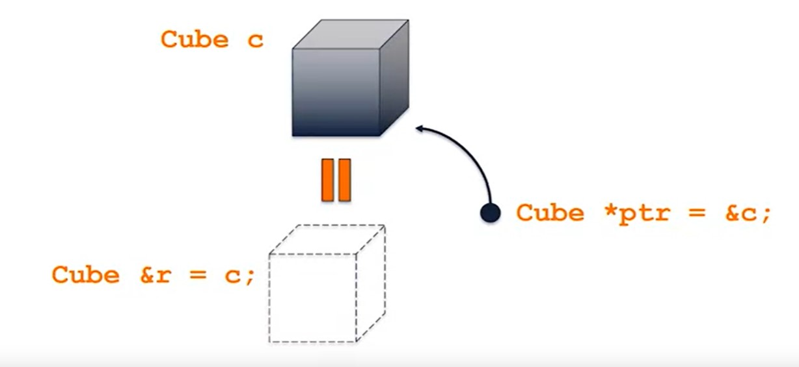

# Introduction to Object-Oriented Data Structures in C++
[C++](@tag/C++)
## C++ Classes

### Encapsulation: single unit with Data and Functionalities, called class

+ Public memebers can be accessed by client code
+ Private members cannot be accesses by client code

Private Functionality:
Private variable: length_

Public Functionality: getVolume()
Public variable:

+ Separate the interface (.h file) from the implementation (.cpp file)

### Header file
+ Declaration of all member vriables
+ Declaration of all member function

~~~
cpp-class/Cube.h
#pragma once //(it means only compile once)

class Cube {
  public:
    double getVolume();
    double getSurfaceArea();
    void setLength(double length);

  private:
    double length_;
};
~~~
Implementation:

~~~
cpp-class/Cube.cpp
#include "Cube.h"

double Cube::getVolume() {
  return length_ * length_ * lenght_;
}

double Cube::getSurfaceArea() {
  return 6 * length_ * length_;
}

void Cube::setLength(double length) {
  length_ = length;
}
~~~

Program that uses the class:

~~~
cpp-class/main.cpp
#include <iostream>
#include "Cube.h"

int main() {
  Cube c;

  c.setLength(3.48);
  double volume = c.getVolume();
  std::cout << "Volume: " << volume << std::endl;

  return 0;
}
~~~

## C++'s Standard Library (std)
The organization on the standard library is divided up into a number of separate files, and we make use of them by including them in any of our C++ programs.
The most used is the iostream.

For often used features. ex: using std::cout; => We use only cout.

We can use namespace for the class we create too.
~~~
uiuc::Cube c;
~~~
So, instead of just calling our class Cube, we want to be able to reuse this Cube and put in a namespace that's separate it from any other namespace. As I mentioned, we put the Cube into our uiuc namespace. This uiuc namespace is added to the Cube class in the h-file. If need to add in both implementation and declaration file (Cube.cpp and Cube.h)
~~~
namespace uiuc {
  ....
  ....
}
~~~

## Stack Memory and Pointers

Variables in C++ have 4 things:
+ name
+ type
+ value
+ location in memory (memory address)

the oprator & return the address of a variable. 

By default every variable in C++ is placed in **stack memory**.
It is associated with the current function, when the function ends or return the memory is released. It always starts from high addresses and goes down to zero.

## Pointer

### Reference operator
A pointer is a variable that stores the memory address of the data. Add * to the tye of the variable.
~~~
int * p = &num
~~~

### Ddeference operator
Given a pointer, a level of indirection can be removed with the deference operator *.

~~~
int num = 7;
int * p = &num;
int value_in_num = *p
*p = 42;
~~~

never return a reference to a local variable, because the space in the stack dedicated to that local variable could not contain what we expect once the function ends.

## Heap Memory
Heap momeory allows to create memory indipendent of the lifecycle of a function.

The **new** operator will always do three things:
+ Allocate memory on the heap for the data structure
+ initialize the data structure
+ Return a pointer to the start of the data structure

The memory is only ever reclaimed by the system when the pointer is passed tp the **delete** operator.

~~~
int * numPtr = new int;
~~~
+ Memory to store an integer pointer on the stack
+ Memory to store an integer on the heap

The stack memory points to the heap memory, which is going to exist for the entire duration of our program unless we call delete.

#### nullptr
is a pointer that points to the memory adress 0x0, which is never used by the system.
When accessed generated a segmentation fault and call to delete it are ignored.

#### Arrow Operator()
When an object is stored via a pointer, access can be mafe to memeber functions using the -> operator 

~~~
c->getVolume();
(*c).getVolume();
~~~

c is a pointer a we are deferencing it 

~~~
int *x = new int;
int &y = *x;
~~~

Int & y is giving us something called a reference variable, and a reference variable. All that reference variable means: it is going to alias another piece of memory which allows us to give a name to a piece of memory. So y is going to alias the dereference value of x, what that means is we can say that this heap memory address is called y. So now we have int ampersand y (int& y), so reference variable y, is going to alias the memory in x.

## Developing C++ classes

### Class contructors

When an instance of a class is created the class constructor sets up the initial state of the object. If a custom constructor is not provided, the C++ compiler provides an automatic default constructor for our class. It initialize all memebers variables to their default state.

### Custom default contructor
Defined by creating:
+ A member function with the same name of the class
+ The function takes zero parameters (no arguments)
+ The function does not have a type return
~~~ 
Cube.h
# pragma once

namespace uiuc {
  class Cube {
    public:
      Cube(); // Custom dfault contructor

      double getVolume();
      double getSyrfaceArea();
      double setLength(double length);
    private:
      double length_;
  }
}

Cube.cpp
#include "Cube.g"

namespace uiuc {
  Cube::Cube() {
    length_ = 1;
  }
}
...
~~~

### Custom non-default constructor
~~~
Cube(double length) // One argument contructor
~~~

You can create more than one contructor. With this custom non default contructor we need to provide the length variable when we call it. The pevious one assign it with out need to pass a value.

**Any constructor at all being defined prevents the automatic default constructor from being defined**

### Copy constructor

make a copy of an existing object

#### automatic copy constructor

If we do not provide a custom copy constructor, the C++ compiler provides an automatic one. It will copy the contents of all memeber variables.

#### Custom copy constructor
+ A class constructor
+ Has exactly one argument
  + const reference of the same type as the class
~~~ 
Cube.h
#pragma once

namespace uiuc {
  class Cube {
    public:
      Cube();  // Custom default constructor
      Cube(const Cube & obj);  // Custom copy constructor

      double getVolume();
      double getSurfaceArea();
      void setLength(double length);

    private:
      double length_;
  };
}

Cube.cpp
#include "Cube.h"
#include <iostream>

namespace uiuc {
  Cube::Cube() {
    length_ = 1;
    std::cout << "Default constructor invoked!" << std::endl;
  }

  Cube::Cube(const Cube & obj) {
    length_ = obj.length_;
    std::cout << "Copy constructor invoked!" << std::endl;
  }

  double Cube::getVolume() {
    return length_ * length_ * length_;
  }

  double Cube::getSurfaceArea() {
    return 6 * length_ * length_;
  }

  void Cube::setLength(double length) {
    length_ = length;
  }
} 
~~~

#### Copy assigment operator
Assign an object to another object. A copy constructor create a new object. An assignment operator assign a value to an existing object and is always called on an object that has already been created.

+ Is a public memeber function of the class
+ Has the function name operator=
+ Has a return value of a reference of the class type
+ Has exactly one argument

~~~
 Cube & Cube::operator=(const Cube & obj) {
    length_ = obj.length_;
    std::cout << "Assignment operator invoked!" << std::endl;
    return *this;
  }
~~~

#### Variable Storage

In C++ an instance of a variable can be stored directly in memory, accessed by pointer, or accessed by reference.

##### Direct storage 
+ The type of the variable has no modifiers.
+ The object takes up exactly its size in memory.

##### Storage by pointer
+ The type of the variable is modified by an asterisk *.
+ A pointer takes a momeory adress width of memory (64 bits on a 64-bit system).
+ The pointer "pouints" to the allocated space of the object.

##### Storage bt reference
+ A reference is an alias to existing memory and is denoted by &.
+ A reference does not store memory, its only an alias to another variable.
+ The alias must be assigned when the variable is initialzied.

##### Pass by ______ to functions

Identical to storage, arguments can be passed to function in three different ways:
+ By value
+ By pointer
+ By reference

##### Return by ______ from functions

Identical to storage, values can be returned from function in three different ways:
+ By value
+ By pointer
+ By reference
Never return a reference to a stack variable created on the stack of your current function!

